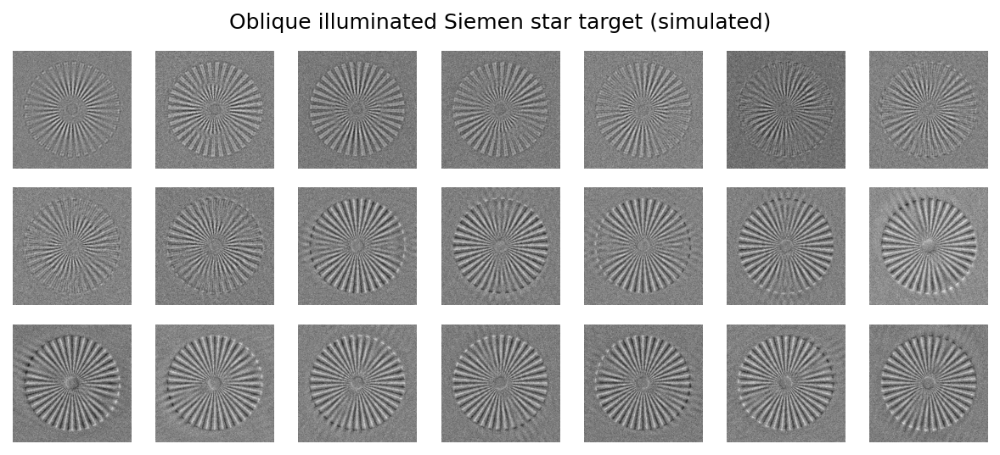
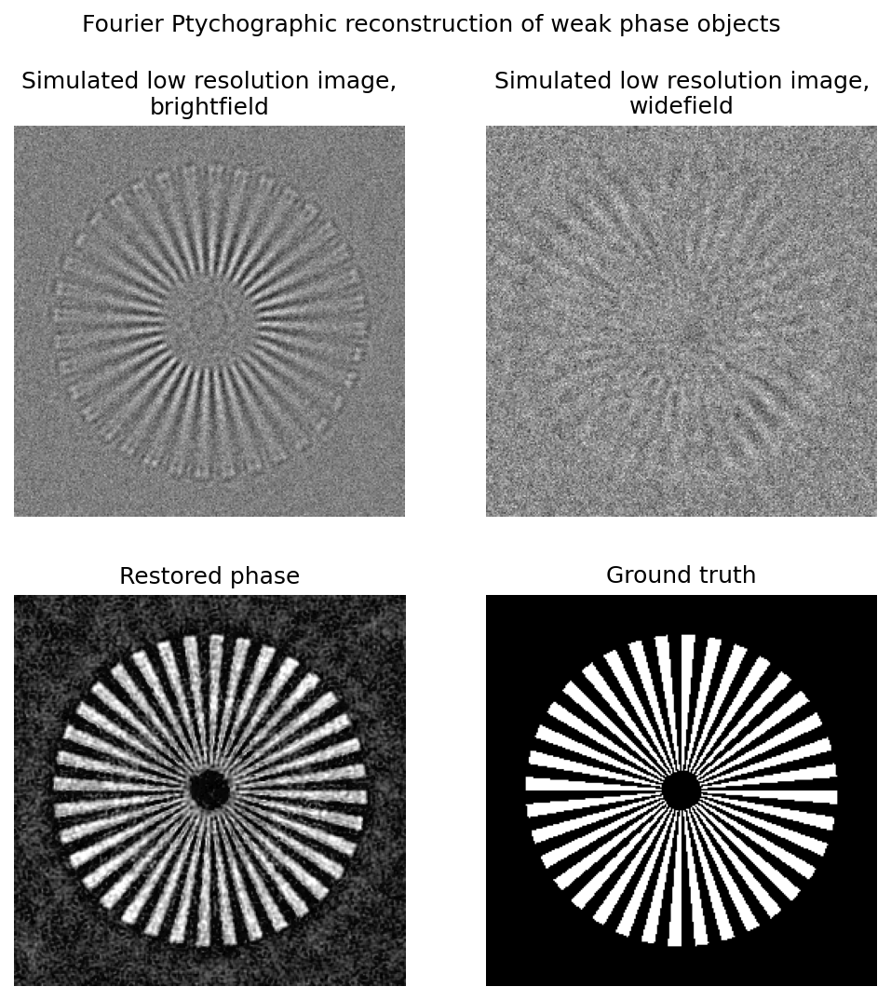

Joint image super-resolution and phase retrieval with Fourier Ptychographic microscopy (FPM)
################################################################################################

**References:**

- **Problem formulation for weak phase objects:** Y. Huang, A.C.S. Chan, A. Pan, and
  C. Yang, "Memory-efficient, Global Phase-retrieval of Fourier Ptychography
  with Alternating Direction Method," in Imaging and Applied Optics 2019 (COSI,
  IS, MATH, pcAOP), OSA Technical Digest (Optica Publishing Group, 2019), paper
  CTu4C.2. https://doi.org/10.1364/COSI.2019.CTu4C.2

- **Derivation of the proximal operator of the complex-valued Poisson norm:** Hanfei
  Yan 2020 New J. Phys. 22 023035. https://doi.org/10.1088/1367-2630/ab704e

- **Imaging instrument specifications and the lens calibration method:** A.C.S.
  Chan, J Kim, A Pan, H Xu, D Nojima, C Hale, S Wang, C Yang, “Parallel Fourier
  ptychographic microscopy for high-throughput screening with 96 cameras (96
  Eyes)” Scientific Reports 9, 11114 (2019).
  http://dx.doi.org/10.1038/s41598-019-47146-z

- **Raw data:** https://academictorrents.com/details/c95c06e98a74a580ccbcceafdc1188ea144021c8

Signal distortion model:

.. math::
    \def\Fourier{\mathbf{F}}
    \def\Pupil{\mathbf{P}}
    \def\Shift{\mathbf{S}}
    \def\Bayer{\mathbf{M}_\mathrm{Bayer,G}}
    \def\Nonneg{\mathcal{I}_+}
    \hat u = \arg \min_{u \in \mathbb{C}}
    \sum_{j=1}^K \left\Vert
    \Bayer | \Fourier^T \Pupil \Shift_j \Fourier u |^2 ,
    b_j \right\Vert_\mathrm{Poisson} +
    0.07 \Vert u - (1 + 0\mathrm{j}) \Vert_2^2 +
    \Nonneg [ \mathrm{Im}(u) ].

Textual representation in ProxImaL:

.. code-block:: python

    problem = Problem(
        weighted_poisson_phase_norm(
            bayer_mask_green_channel,
            ptychography(u) * sqrt(1e3),
            simulated_lowres * 1e3,
        ) +
        sum_squares(u - 1.0) * 0.07 +
        nonneg(u),
    )

Example code: https://github.com/comp-imaging/ProxImaL/blob/master/proximal/examples/fourier-ptychography.py

    Oblique illuminated Siemen star resolution target (simulated):

    Fourier ptychographic phase retrieval results, compared to ground truth.