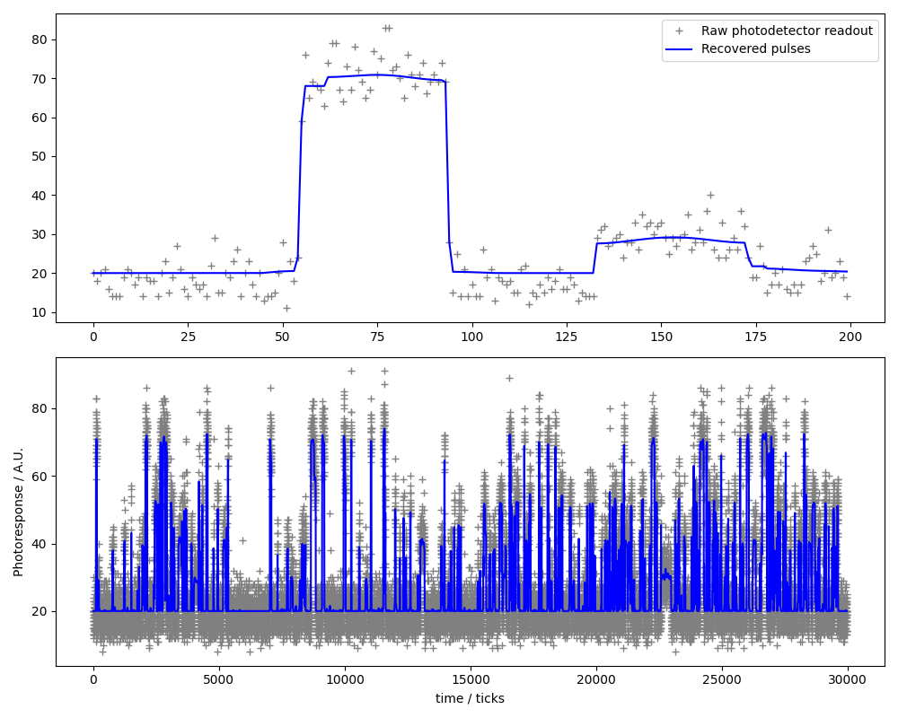

Pulse calling of single-molecule events
##########################################

**Reference:** Brian D. Reed et al., Real-time dynamic single-molecule protein
sequencing on an integrated semiconductor device. Science 378, 186-192(2022).
DOI: https://doi.org/10.1126/science.abo7651

Subset of raw data retrieved on July 16, 2023, from https://zenodo.org/records/6789017 .

.. warning::

    The original pulse-recovery method was designed for a streaming processor
    architecture, likely optimized for reconfigurable hardware having
    fixed-point arithmetic such as FPGAs. The convex-optimization approach
    implemented here instead processes data in batches of roughly 30,000 samples
    and is better suited to GPU execution having single/half-precision floating
    point arithmetic. Batch-based processing may introduce boundary artifacts,
    reflecting a trade-off inherent to this non-streaming formulation.

Signal distortion model:

.. math::
    \min_u \| u - (b - 20)/128 \|_2^2 + 0.4 \| \nabla u \|_1  + \mathtt{nonneg}(u)

Textual representation in ProxImaL:

.. code-block:: python

    prob = Problem(
        sum_squares(u - (b - 20.0) / 255.0) + 0.4 * norm1(grad(u)) + nonneg(u))

Example code: https://github.com/comp-imaging/ProxImaL/blob/master/proximal/examples/test_pulse_calling.py

Expected output:

