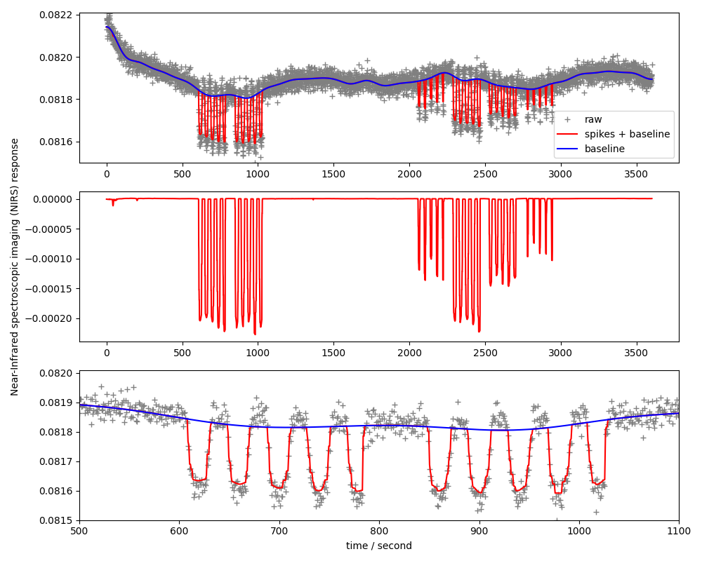

Spike-baseline signal separation of time-lapse signals
##########################################################

**Reference:** I. W. Selesnick, H. L. Graber, D. S. Pfeil and R. L. Barbour,
"Simultaneous Low-Pass Filtering and Total Variation Denoising," in IEEE
Transactions on Signal Processing, vol. 62, no. 5, pp. 1109-1124, March1, 2014,
https://doi.org/10.1109/TSP.2014.2298836

Signal distortion model:

.. math::
    \min_{u,v} \| \mathrm{DCT}^{-1}(v) - u - b \|_2^2 +
     0.16 \Vert \nabla u \Vert_1
     + 0.04 \Vert u \Vert_1
     + \mathtt{nonneg}(u)

Textual representation in ProxImaL:

.. code-block:: python

    prob = Problem([
            sum_squares(idct_op(baseline) - spikes - measurement),
            0.16 * norm1(grad(spikes)),
            0.04 * norm1(spikes),
            nonneg(u),
    ])

Example code: https://github.com/comp-imaging/ProxImaL/blob/master/proximal/examples/near-infrared-spectroscopic-imaging.py

Expected output:

