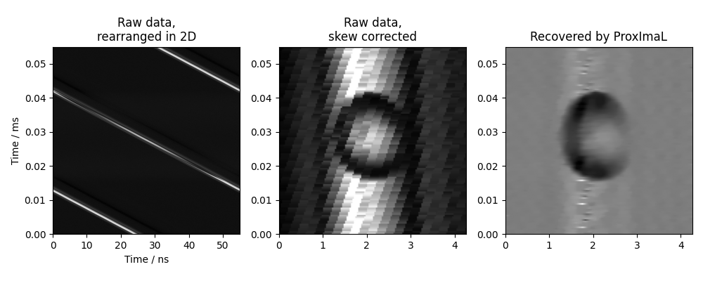

Pixel super-resolution of oil emulsion droplets under high-speed camera
########################################################################

**References:** A.C.S. Chan, H.C. Ng, S.C.V. Bogaraju, H.K.H. So, E.Y. Lam, and
K.K. Tsia, "All-passive pixel super-resolution of time-stretch imaging,"
Scientific Reports, vol. 7, no. 44608, 2017. DOI:
http://dx.doi.org/10.1038/srep44608.

.. note::

    The original pixel super-resolution algorithm is meant for a streaming processor
    architecture, likely optimized for reconfigurable hardware having
    fixed-point arithmetic such as FPGAs. The convex-optimization approach
    implemented here instead processes data in batches of roughly 1000 raster scan lines,
    and is better suited to GPU execution having single/half-precision floating
    point arithmetic. Batch-based processing may introduce boundary artifacts,
    reflecting a trade-off inherent to this non-streaming formulation.

    Refer to the following article for the baremetal FPGA implementation: Shi R,
    Wong JSJ, Lam EY, Tsia KK, So HK. A Real-Time Coprime Line Scan
    Super-Resolution System for Ultra-Fast Microscopy. IEEE Trans Biomed
    Circuits Syst. 2019 Aug;13(4):781-792. doi:
    https://doi.org/10.1109/TBCAS.2019.2914946.

Raw data:
http://academictorrents.com/details/a8d14f22c9ce1cc59c9f480df5deb0f7e94861f4

Signal distortion model:

.. math::
    \min_u \left\Vert \mathbf{M} [\mathbf{W} (u + u_0) - b] \right\Vert_2^2 +
    0.005 \| \nabla u \|_{2,1}.

Textual representation in ProxImaL:

.. code-block:: python

    prob = Problem(
        sum_squares(
            mul_elemwise(
                mask,
                warp(
                    pad(u + u_0, b.shape),
                    M,
                ) - b,
            )
        ) +
        5e-3 * group_norm1(grad(u), group_dims=[2]),
    )

Example code: https://github.com/comp-imaging/ProxImaL/blob/master/proximal/examples/test_pixel_sr.py

.. warning::

    Illumination background extraction for ``u_0`` via the one-dimensional
    Pixel-SR method (aka the `equivalent time sampling method
    <https://www.tek.com/en/documents/application-note/real-time-versus-equivalent-time-sampling>`_),
    is omitted here for the sake of demonstration.

**Expected output:**

.. figure:: ../files/pixel-sr-time-trace.png

    Raster scan lines captured and digitized at 5 Giga-Sample/second.

    Reconstructed oil emulsion droplets in the microfluidic channel, at the
    linear velocity of 0.3 meter/second and a droplet generation rate of 5,800 Droplet/s.