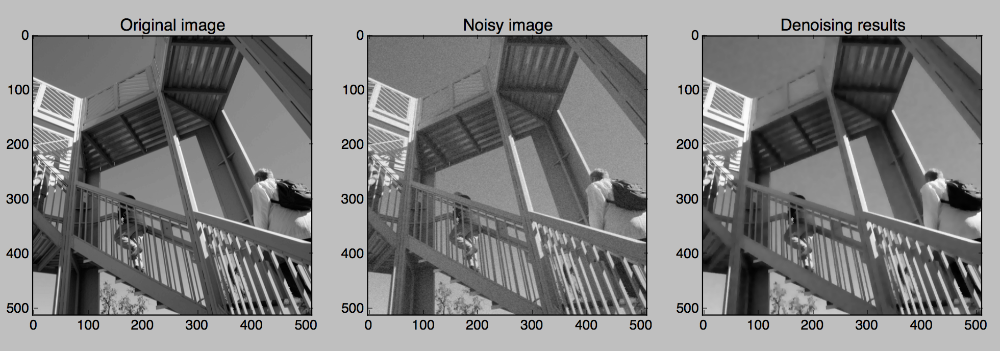

.. cvxpy documentation master file, created by
   sphinx-quickstart on Mon Jan 27 20:47:07 2014.
   You can adapt this file completely to your liking, but it should at least
   contain the root `toctree` directive.

Welcome to ProxImaL
=====================

ProxImaL is a Python-embedded modeling language for image optimization problems. 
It allows you to express your problem in a natural way that follows the math, 
and automatically determines an efficient method for solving the problem.
ProxImaL makes it easy to experiment with many different priors and other problem reformulations,
without worrying about the details of how the problem is solved.

For example, the following code denoises an image using simple sparse gradient and nonnegativity priors:

.. code:: python

          from proximal import *
          import numpy as np
          import scipy.misc
          import matplotlib.pyplot as plt

          # Generate data.
          I = scipy.misc.ascent()
          np.random.seed(1)
          b = I + 10*np.random.randn(*I.shape)

          # Construct and solve problem.
          x = Variable( I.shape )
          prob = Problem(sum_squares(x - b/255) + .1*norm1( grad(x) ) + nonneg(x))
          prob.solve()

          # Plot the original, noisy, and denoised images.
          plt.figure(figsize=(15,8))
          plt.subplot(131)
          plt.gray()
          plt.imshow(I)
          plt.title('Original image')

          plt.subplot(132)
          plt.gray()
          plt.imshow(b)
          plt.title('Noisy image')

          plt.subplot(133)
          plt.gray()
          plt.imshow(x.value*255) # x.value is the optimal value of x.
          plt.title('Denoising results')
          plt.show()

The example above uses simple, well-known priors. Much better results can be obtained using the more sophisticated priors provided in ProxImaL.

ProxImaL was designed and implemented by Felix Heide and Steven Diamond.
See `the accompanying paper <http://web.stanford.edu/~stevend2/pdf/proximal.pdf>`_ for a full discussion of ProxImaL's design and examples of state-of-the-art results obtained with ProxImaL.

.. toctree::
   :hidden:

   install/index

.. toctree::
    :maxdepth: 3
    :hidden:

    tutorial/index

..
   .. toctree::
      :hidden:

      examples/index

.. toctree::
   :hidden:

   publications/index
